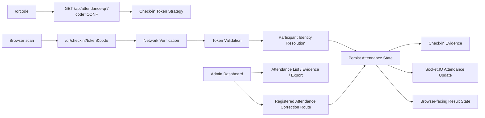
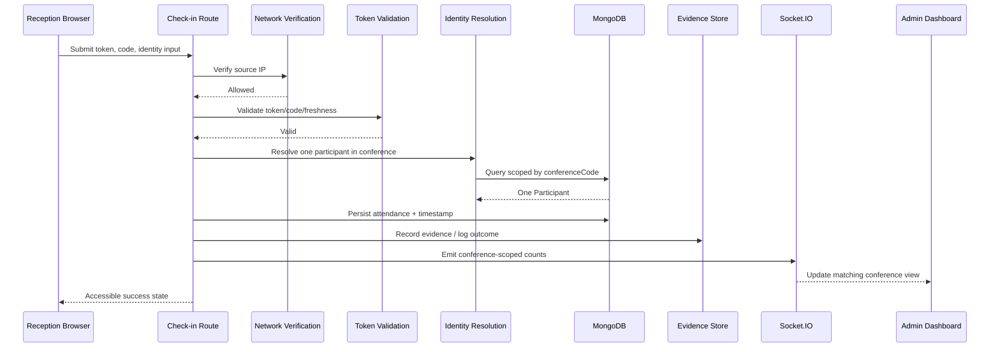

# Architecture Spine - Dynamic QR Attendance and Check-in

## Design Paradigm

Keep the existing layered MVC shape, but make persisted attendance state the authority. QR validation admits a request into the check-in flow; it is not attendance. Participant identity resolution, attendance mutation, audit evidence, admin views, exports, and realtime updates must all read or write persisted state scoped by `conferenceCode`.



## Invariants & Rules

### AD-1 - QR issuance is conference-scoped and validates conference existence

- **Binds:** `GET /api/attendance-qr`, QR page refresh behavior.
- **Prevents:** Generating usable check-in URLs for stale, missing, or unknown conference codes.
- **Rule:** Attendance QR issuance must validate one active or explicitly selected `Conference.code` before creating a token. The returned check-in URL, token metadata, expiry timestamp, and QR image all belong to exactly one `conferenceCode`.

### AD-2 - Token validation strategy is a deployment decision

- **Binds:** `attendanceQrStore`, `requireValidAttendanceQrToken`, PM2 deployment.
- **Prevents:** Valid QR scans failing because generation and validation hit different Node workers.
- **Rule:** Process-local token memory is unsafe for PM2 cluster or any multi-process deployment unless the product owner explicitly accepts single-process mode or sticky routing as an event-day constraint. Before implementation, choose one: shared token store, stateless signed token, sticky routing, or single-process deployment. **Decision Required:** final token validation strategy and deployment constraint.

### AD-3 - Server time is the authority for QR freshness

- **Binds:** QR expiry metadata, token validation, QR refresh page.
- **Prevents:** Client clock drift from accepting or rejecting check-in attempts.
- **Rule:** The server sets token creation and expiry times, validates freshness, and returns expiry metadata for display/refresh only. Client-side timers may refresh UI but never decide validity.

### AD-4 - Network Verification runs before token or identity work on protected routes

- **Binds:** `ipFilter`, `/qr/checkin`, future check-in POST/API routes.
- **Prevents:** Off-network requests from consuming token/identity work or mutating attendance.
- **Rule:** Required check-in routes pass through Network Verification before token validation and before participant lookup. Browser denials render an access-denied state; API denials return structured `403` JSON.

### AD-5 - Trusted source IP handling must be explicit

- **Binds:** `ipFilter`, reverse proxy configuration, deployment docs.
- **Prevents:** Spoofed `x-forwarded-for` headers from bypassing venue network controls.
- **Rule:** The app may trust forwarded IP headers only when it is behind a configured trusted proxy boundary. Direct deployments must use socket/request IP authority and must not treat arbitrary `x-forwarded-for` as security input. **Decision Required:** deployed proxy mode and allowlist source for event day.

### AD-6 - Participant identity resolution is separate from QR validation

- **Binds:** `/qr/checkin`, participant lookup, check-in result states.
- **Prevents:** Treating a shared QR scan as proof of who attended.
- **Rule:** A valid token must lead to exactly one resolved `Participant` within the scanned `conferenceCode` before attendance can be recorded. No match produces a not-found state; multiple matches produce an ambiguous state; neither path mutates attendance. **Decision Required:** v1 identity input: email, phone, participant ID plus conference code, admin-selected participant, or registration confirmation artifact.

### AD-7 - Participant identity is conference-scoped

- **Binds:** `Participant.participantId`, `Counter`, admin lookup, check-in lookup.
- **Prevents:** Cross-conference participant ID collisions and wrong-person check-in.
- **Rule:** Any lookup by human-facing `participantId` must include `conferenceCode`. The database uniqueness strategy must allow the same participant ID in different conferences while preventing duplicates inside one conference.

### AD-8 - Attendance persistence is the success boundary

- **Binds:** check-in success view, admin counts, realtime updates, exports.
- **Prevents:** Showing success, emitting updates, or exporting attendance based on unsaved state.
- **Rule:** A check-in is successful only after persisted state records the participant as checked in with a timestamp. Duplicate check-ins must be idempotent or explicitly marked duplicate without creating conflicting attendance state. Persisted state is the authority for all views after refresh.

### AD-9 - Check-in evidence has a minimum audit shape

- **Binds:** check-in event/audit model, admin evidence inspection, logs.
- **Prevents:** Post-event reports that cannot explain how attendance was recorded.
- **Rule:** Successful check-in evidence must include participant identifier, `conferenceCode`, timestamp, check-in path, and actor/source when available. Denied, expired, mismatched, duplicate, not-found, ambiguous, and manually corrected outcomes must be diagnosable without logging secrets, token values, full phone numbers, or unnecessary full email addresses. **Decision Required:** store evidence in `Participant`, a separate collection, or both.

### AD-10 - Admin attendance inspection is read-model first

- **Binds:** admin dashboard data API, attendance list, filters, export.
- **Prevents:** Admin correction routes becoming the only way to inspect attendance state.
- **Rule:** Admin surfaces must expose a conference-scoped attendance list with filters for checked-in, not checked-in, duplicate, and manually corrected states where those states exist. The list must show participant-level attendance state and link to inspect evidence fields from AD-9 according to role permissions.

### AD-11 - Attendance correction is a registered secured route

- **Binds:** admin dashboard attendance buttons, `backend/routes/admin.js`, CSRF/authz.
- **Prevents:** UI controls calling missing routes or mutating attendance through authentication-only endpoints.
- **Rule:** Admin correction uses a registered backend route that requires authentication, role authorization, CSRF protection for browser session mutations, participant identity plus `conferenceCode`, and a reason/source for manual correction. Successful corrections persist state and may emit a conference-scoped realtime update.

### AD-12 - Role permissions are enforced on every attendance surface

- **Binds:** QR generation, attendance counts, participant-level list, evidence inspection, export, correction, network configuration, bulk email.
- **Prevents:** Securing mutation while leaving read/export/configuration surfaces ungoverned.
- **Rule:** Apply this default role matrix until the product owner changes it:

| Surface / Action | admin | manager | staff | receptionist | user |
| --- | --- | --- | --- | --- | --- |
| Generate Attendance QR | allow | allow | allow | allow | deny |
| View attendance counts | allow | allow | allow | allow | deny |
| View participant-level attendance list | allow | allow | allow | allow own desk scope if introduced | deny |
| Inspect check-in evidence | allow | allow | allow limited non-sensitive fields | deny by default | deny |
| Export attendance | allow | allow | deny by default | deny | deny |
| Correct attendance state | allow | allow | deny by default | deny by default | deny |
| Configure Network Verification | allow | deny by default | deny | deny | deny |
| Send conference-scoped bulk email if included | allow | allow | deny | deny | deny |

**Decision Required:** final `User.userRole` policy, including whether `staff` or `receptionist` can correct attendance.

### AD-13 - CSRF protection is mandatory for admin browser mutations

- **Binds:** attendance correction, conference-scoped bulk email, network configuration mutations.
- **Prevents:** Session-cookie admin actions being triggered cross-site.
- **Rule:** Browser-session admin mutations must validate CSRF before changing attendance, sending conference-scoped email, or changing network verification settings. API-style non-browser callers must use an explicit authenticated mechanism before they can bypass the browser CSRF path. **Decision Required:** CSRF mechanism and rollout path.

### AD-14 - Realtime updates are emitted after persistence and scoped by conference

- **Binds:** Socket.IO server, admin dashboard, public React dashboard boundaries.
- **Prevents:** Realtime drift, cross-conference count pollution, and participant-level leakage.
- **Rule:** Attendance updates are emitted only after persistence succeeds. Payloads include `conferenceCode` and aggregate attendance counts. Dashboards ignore payloads for other conferences. Participant-level attendance data remains behind authenticated admin routes.

### AD-15 - Dashboard refresh/polling is the recovery path

- **Binds:** admin dashboard count API, Socket.IO fallback.
- **Prevents:** Operations depending solely on live socket delivery.
- **Rule:** Manual refresh or polling reads persisted attendance counts and becomes the displayed authority after socket disconnect or disagreement.

### AD-16 - Exports distinguish registration from attendance

- **Binds:** admin export, post-event reporting.
- **Prevents:** Reports that imply registration equals presence.
- **Rule:** Attendance exports scoped by `conferenceCode` must include registered participant fields, checked-in/not-checked-in state, check-in timestamp when available, manual correction marker when applicable, and evidence source/path fields that are safe for export. Not checked in must not imply an absence was manually verified.

### AD-17 - Browser-facing result states are accessible by content, not color

- **Binds:** success, duplicate, not-found, expired, denied, ambiguous views.
- **Prevents:** Event-day staff or participants missing critical state because color was the only signal.
- **Rule:** Every browser-facing check-in state includes a clear heading, visible text label, and screen-reader-friendly status text where practical. Icons may supplement state but cannot replace text. The required states are success, duplicate, not found, ambiguous identity, expired/invalid token, and denied network.

### AD-18 - Performance criteria are part of implementation readiness

- **Binds:** check-in route, identity lookup, persistence, audit write, realtime emit, rehearsal.
- **Prevents:** Shipping a correct flow that creates reception queues.
- **Rule:** Normal internal event load is 4 concurrent reception desks/scanners, each processing one check-in every 10 seconds for 10 minutes, plus a 60-second burst at twice that rate. Pass/fail: at least 95% of successful check-ins complete within 2 seconds, no more than 1% server-side non-validation errors, and persisted attendance counts match completed check-ins after refresh.

## Consistency Conventions

| Concern | Convention |
| --- | --- |
| Source of truth | Persisted `Participant` attendance fields plus chosen evidence store. |
| Conference scope | Every check-in, admin read, correction, realtime update, and export carries `conferenceCode`. |
| Token lifetime | Preserve 30 seconds unless a product decision changes it. |
| Identity lookup | Never use `participantId` alone; include `conferenceCode`. |
| Manual correction | Requires role authorization, CSRF, participant plus conference, timestamp, actor/source, and reason where practical. |
| Logs | Log outcome, conference, route, timestamp, and coarse reason; avoid token values and unnecessary PII. |
| Realtime | Persist first, emit second, refresh/poll persisted state for recovery. |
| Public surfaces | No participant-level attendance data; aggregate attendance remains admin-only unless approved. |

## Structural Seed

```text
backend/routes/attendanceQr.js
  Issues conference-scoped QR metadata and check-in URLs.

backend/middleware/attendanceQr.js
  Validates token freshness and conference match after Network Verification.

backend/middleware/ipFilter.js
  Enforces allowlisted source networks under explicit trusted-proxy assumptions.

backend/controllers/adminController.js + backend/routes/admin.js
  Own admin attendance list, evidence inspection, correction, export, and optional bulk email routes.

backend/models/Participant.js
  Stores attendance state, check-in timestamp, participant identity, and conference scope.

Check-in evidence store
  Decision Required: Participant-only fields, separate collection, or both.

Socket.IO
  Emits conference-scoped persisted attendance counts after check-in or admin correction.
```



## Role Matrix

The role matrix in AD-12 is the implementation contract until changed by a product decision. Stories must not scope only mutations; they must apply the same role policy to counts, participant-level list, evidence inspection, export, QR generation, network configuration, and conference-scoped bulk email.

## Performance and Load-Test Expectations

- Internal event target: 4 concurrent reception desks/scanners.
- Normal scenario: each desk completes one valid check-in every 10 seconds for 10 minutes.
- Burst scenario: twice normal rate for 60 seconds.
- Pass/fail thresholds: p95 successful check-in latency under 2 seconds, server-side non-validation error rate under 1%, no lost persisted attendance records, dashboard refresh counts match persisted state.
- Test level: service/controller integration tests for timing-sensitive boundaries where practical; a rehearsal load script or manual API-driven load check before internal production.

## Accessibility Expectations

Required browser states: success, duplicate, not-found, ambiguous identity, expired/invalid token, and denied network. Each state must have:

- a clear heading naming the state;
- visible text describing the next action;
- no color-only meaning;
- screen-reader-friendly status text where practical;
- consistent Vietnamese/English copy policy matching the surrounding flow.

## Deferred / Decision Required

| Decision Required | Blocks |
| --- | --- |
| Token validation strategy: shared store, stateless signed token, sticky routing, or single-process event-day deployment | QR validation implementation, PM2 readiness |
| Trusted proxy mode and allowlist source | Network Verification implementation |
| Participant identity input for v1 | Check-in form/API shape, ambiguous lookup behavior |
| Evidence storage model: Participant fields, separate collection, or both | Audit inspection, exports, retention tests |
| Final role permissions for `admin`, `manager`, `staff`, `receptionist`, `user` | Admin view/export/correction and QR generation authorization |
| CSRF mechanism for admin browser mutations | Attendance correction and conference-scoped bulk email routes |
| Retention duration and owner for attendance evidence | Post-event reporting and data governance |
| Public aggregate attendance approval | Public dashboard/API exposure |
| Conference-scoped bulk email inclusion or removal | EP-08 implementation path |

## Open Questions

| Question | Needed for |
| --- | --- |
| Should duplicate check-in be rendered as idempotent success or a distinct duplicate warning? | Result-state UX and audit vocabulary |
| Should manual correction require a free-text reason or a controlled reason enum? | Admin correction route and export fields |
| Should receptionist role ever inspect participant-level evidence, or only perform guided check-in? | Role authorization matrix |
