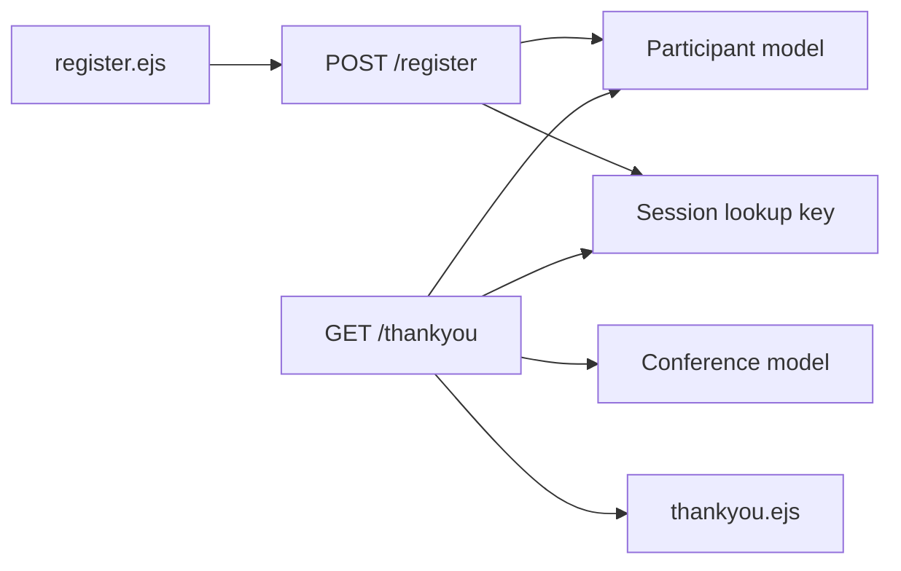
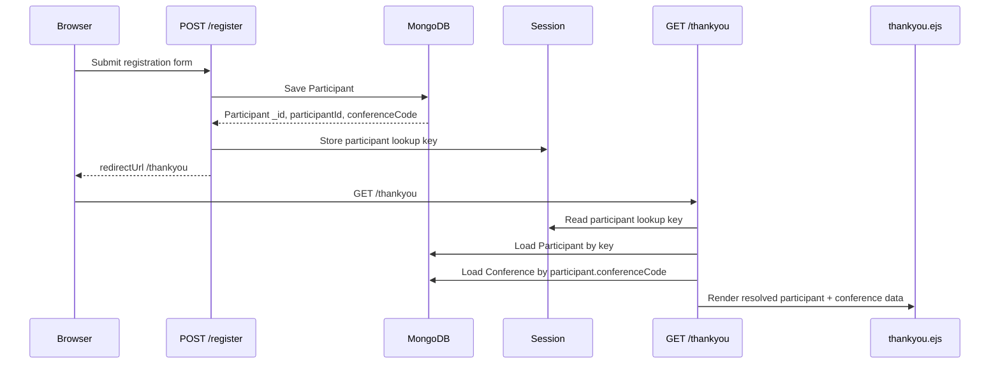

# Architecture Spine - Register Thankyou Data Correctness

## Design Paradigm

Keep the existing layered MVC shape:



The registration controller owns creation. The thank-you route owns reconstruction of the confirmation view model. The EJS template only displays the resolved view model.

## Invariants & Rules

### AD-1 - Thank-you identity is the created registration

- **Binds:** `POST /register`, `GET /thankyou`
- **Prevents:** Rendering another participant when the same email exists in another conference, or when email-only lookup returns the wrong record.
- **Rule:** After saving `Participant`, `POST /register` must store a stable lookup key for that exact participant in session. `GET /thankyou` must use that key to load the persisted participant. Email alone is not a valid identity for the thank-you page.

### AD-2 - Conference context follows the participant

- **Binds:** `GET /thankyou`, `thankyou.ejs`
- **Prevents:** Showing event dates, location, contact data, or registration field visibility from the latest conference instead of the conference just registered.
- **Rule:** `GET /thankyou` must resolve `Conference` by the loaded participant's `conferenceCode`. The current "latest conference by createdAt" query is not valid for confirmation rendering.

### AD-3 - Session is a pointer, not the source of truth

- **Binds:** registration success redirect, refresh behavior, fallback behavior
- **Prevents:** Session snapshots drifting from the persisted participant or hiding database write/read bugs.
- **Rule:** Session may carry only the keys needed to reload the confirmation state, plus minimal fallback display values for error handling. Normal rendering must prefer the persisted `Participant` and `Conference`.

### AD-4 - The thank-you view model owns display aliases

- **Binds:** `GET /thankyou`, `thankyou.ejs`
- **Prevents:** Template-level mismatches such as checking `participantId` while the route only passes `participant.participantId`.
- **Rule:** `GET /thankyou` must pass every top-level value the template checks, or the template must consistently read from the `participant` object. Do not split one displayed concept across both shapes.

## Consistency Conventions

| Concern | Convention |
| --- | --- |
| Registration identity | Prefer `participant._id` in session for exact record lookup; keep `participantId` for human-facing display. |
| Conference lookup | Resolve by `participant.conferenceCode`; fallback to `req.session.conferenceCode` only when no persisted participant is available. |
| Dates | Display event dates from the resolved `Conference`; display registration date from the resolved `Participant`. |
| Field visibility | Use `conference.registrationFields` from the participant's conference, not from the newest conference. |
| View data | Build a single thank-you view model in the route before calling `res.render`. |

## Stack

| Name | Version |
| --- | --- |
| Node.js app entry | `backend/server.js` |
| Express | `^4.18.2` |
| EJS | `^3.1.9` |
| express-session | `^1.17.3` |
| Mongoose | `^7.6.3` |
| MongoDB | via `MONGODB_URI` |
| Jest | `^29.7.0` |

## Structural Seed

```text
backend/controllers/registerController.js
  POST /register creates Participant and stores exact participant lookup key.

backend/server.js
  GET /thankyou reloads Participant, resolves Conference by participant.conferenceCode, builds view model.

frontend/views/thankyou.ejs
  Displays only the resolved thank-you view model.
```



## Capability To Architecture Map

| Area | Lives in | Governed by |
| --- | --- | --- |
| Participant creation | `backend/controllers/registerController.js` | AD-1, AD-3 |
| Confirmation state reconstruction | `backend/server.js` `/thankyou` | AD-1, AD-2, AD-3, AD-4 |
| Registration detail display | `frontend/views/thankyou.ejs` | AD-2, AD-4 |
| Regression coverage | `__tests__/` focused route/controller tests | AD-1, AD-2, AD-4 |

## Implementation Plan Support

Confirmed symptom: `targetAudience` selected on the registration page can render incorrectly or fail to render on the thank-you page because the page may use another conference's `registrationFields`.

1. Done: change `POST /register` to store `participant._id` in session after `await participant.save()`.
2. Done: change `/thankyou` to query `Participant` by that `_id`, not by email.
3. Done: change `/thankyou` to query `Conference` by the participant's `conferenceCode`, not by latest `createdAt`.
4. Done: normalize the rendered data shape so the registration id is shown from one source, either `participant.participantId` or an explicit top-level `participantId`.
5. Done: add focused tests for:
   - same email cannot produce wrong thank-you identity across conferences;
   - thank-you conference details come from the participant's conference;
   - registration id appears on the thank-you page.

## Deferred

| Decision | Why deferred |
| --- | --- |
| Whether thank-you pages should be bookmarkable without session | The current app redirects to `/thankyou` using session state. A tokenized public confirmation URL is a product/security decision beyond this bug slice. |
| Whether participant IDs become per-conference unique in MongoDB indexes | The current schema marks `participantId` globally unique, while docs mention conference-specific IDs. That is a broader data migration/index decision. |
| Whether `/thankyou` should move from `backend/server.js` into a controller | Useful cleanup, but not required to fix the incorrect data contract. |

## Open Questions

| Question | Needed for |
| --- | --- |
| Should confirmation data remain available after browser/session loss? | Determines whether session pointer is enough or whether a signed confirmation URL is required. |
