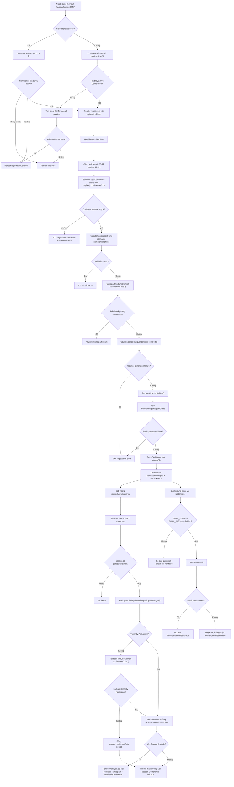
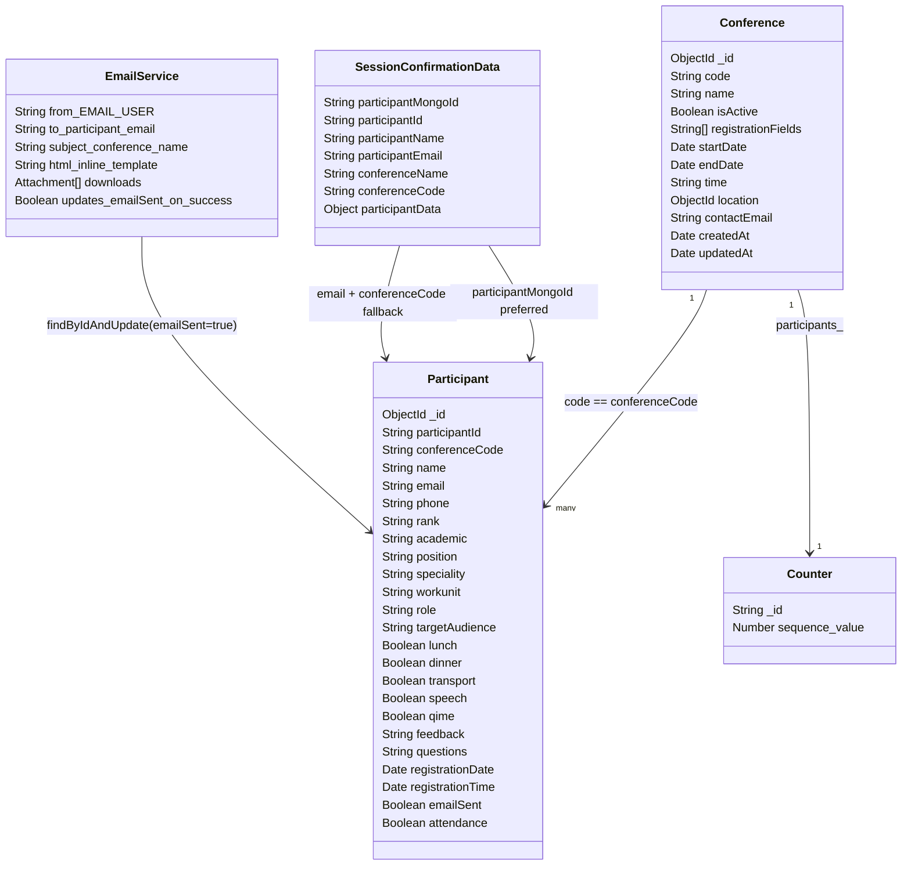

# Register -> Thankyou -> Email workflow

## 1. Executive summary

Người dùng mở trang `GET /register?code=CONF`. Backend đọc mã hội nghị từ query string `code`, tìm `Conference` theo `code`, kiểm tra `isActive`, rồi render `frontend/views/register.ejs` với danh sách trường đăng ký lấy từ `conference.registrationFields`.

Người dùng nhập dữ liệu trên form: các trường bắt buộc mặc định là `name`, `email`, `phone`; các trường khác phụ thuộc `Conference.registrationFields`, ví dụ `rank`, `academic`, `position`, `speciality`, `workunit`, `role`, `targetAudience`, `lunch`, `dinner`, `transport`, `speech`, `feedback`, `questions`, `qime`, `source`, `address`, `age`, `business`, `nationality`.

Frontend gom dữ liệu form thành JSON và gửi `POST /register`. Backend tìm `Conference` active theo `req.body.conferenceCode`, chạy validation server-side, chuẩn hóa `name`, `email`, `phone`, kiểm tra trùng `Participant` theo `{ email, conferenceCode }`, tăng `Counter` bằng `Counter.getNextSequenceValue(confCode)`, tạo `participantId` 4 chữ số, sau đó save `Participant` vào MongoDB.

MongoDB collections trong flow chính:

- `conferences`: đọc để render form, đọc để xác định hội nghị active khi submit, đọc lại trên `/thankyou`.
- `counters`: tăng counter `_id = participants_<CONFCODE>` để sinh `participantId`.
- `participants`: ghi participant mới, đọc lại participant trên `/thankyou`, update `emailSent` sau khi gửi email thành công.
- Session store của `express-session`: mặc định là MemoryStore nếu chưa cấu hình store riêng; lưu các key tạm thời cho trang `/thankyou`.

System-generated fields:

- `Participant._id`: MongoDB ObjectId.
- `participantId`: chuỗi 4 chữ số sinh từ `Counter.sequence_value`.
- `conferenceCode`: lấy từ `Conference.code`.
- `registrationTime`: `new Date()` trong controller.
- `registrationDate`: default `Date.now` từ schema.
- `emailSent`: default `false`, update thành `true` nếu Nodemailer gửi thành công.
- `attendance`: default `false`.

Session data currently stored after successful save:

- `participantName`
- `participantEmail`
- `conferenceName`
- `conferenceCode`
- `participantMongoId`
- `participantId`
- `participantData`

Trang `/thankyou` yêu cầu `req.session.participantEmail` tồn tại. Nếu có, route gọi `buildThankyouViewModel(req.session)`. View model ưu tiên đọc participant bằng `session.participantMongoId`, fallback bằng `{ email: session.participantEmail, conferenceCode: session.conferenceCode }`, đọc `Conference` bằng `participant.conferenceCode` hoặc `session.conferenceCode`, rồi render `frontend/views/thankyou.ejs`.

Email xác nhận được gửi sau khi response đăng ký đã trả về. Controller dùng `req.body`, `participantData`, và `conference` đang có trong closure để tạo HTML email, gọi `transporter.sendMail(mailOptions)`, sau đó update `Participant.emailSent = true` bằng `Participant.findByIdAndUpdate(participant._id, { emailSent: true })` nếu gửi thành công.

## 2. Actual source file map

| Concern | File path | Function/route/component/template | What it does |
| --- | --- | --- | --- |
| Express app setup | `backend/server.js:41-50` | `express.json`, `express.urlencoded`, `express-session` | Parses JSON/form body and creates session middleware. |
| Register route mount | `backend/server.js:101-103` | `app.use('/register', registerRoutes)` | Mounts register routes. |
| Thankyou route | `backend/server.js:241-286` | `GET /thankyou` | Requires `session.participantEmail`, builds view model, renders `thankyou`, or fallback renders session data on error. |
| Register routes | `backend/routes/register.js:6-16` | `GET /`, `GET /:conferenceCode`, `POST /`, `POST /:conferenceCode` | Maps `/register` and `/register/:conferenceCode` to controller methods. |
| Register page controller | `backend/controllers/registerController.js:18-91` | `showRegisterForm` | Reads `req.query.code`, loads active conference, formats date/location, renders `register`. |
| Registration submit controller | `backend/controllers/registerController.js:93-302` | `registerParticipant` | Validates input, checks duplicate, generates participant ID, saves participant, writes session keys, returns redirect JSON, sends email in background. |
| Email sender | `backend/controllers/registerController.js:9-16`, `214-293` | Nodemailer transporter and `setImmediate` block | Configures Nodemailer, builds attachments and HTML, sends confirmation email, updates `emailSent`. |
| Server-side validation | `backend/middleware/registrationValidation.js:1-126` | `validateRegistrationForm` | Sanitizes core fields, validates email/phone, enforces dynamic required fields. |
| Thankyou view model | `backend/services/thankyouViewModel.js:20-75` | `findRegisteredParticipant`, `findRegisteredConference`, `buildThankyouViewModel` | Resolves persisted participant/conference from session pointers and constructs template data. |
| Participant model | `backend/models/Participant.js:3-143` | `participantSchema` | Defines registration fields, defaults, `emailSent`, `attendance`, and globally unique `participantId`. |
| Conference model | `backend/models/Conference.js:3-132` | `conferenceSchema` | Defines conference metadata, active flag, location, contact details, and dynamic `registrationFields`. |
| Counter model | `backend/models/Counter.js:3-32` | `getNextSequenceValue` | Atomically increments `participants_<CONFCODE>` and returns next sequence. |
| Register template | `frontend/views/register.ejs:12-14`, `480-591` | Form and submit script | Renders hidden `conferenceCode`, dynamic fields, client validation config, JSON submit to `/register`, redirects to `/thankyou`. |
| Client validation | `frontend/public/js/register-validation.js:1-290` | `window.__registerValidation` | Validates required dynamic fields, phone, email, and applies server validation errors. |
| Thankyou template | `frontend/views/thankyou.ejs:11-255`, `319-515` | Confirmation page and PDF script | Displays conference and participant data from view model; includes inactive PDF-generation code guarded by missing button. |
| Thankyou tests | `__tests__/thankyouViewModel.test.js:7-184` | Unit tests | Verifies `_id` lookup, email+conference fallback, session fallback, and date formatting. |
| Validation tests | `__tests__/registrationValidation.test.js:7-70` | Unit tests | Verifies phone/email validation, core sanitization, optional feedback/questions behavior. |

No separate confirmation email template file was found. Confirmation email HTML is inline in `backend/controllers/registerController.js:237-278`.

## 3. UML sequence diagram

```mermaid
sequenceDiagram
    autonumber
    actor User as User Browser
    participant Form as Register Page / Form
    participant GetRegister as Express Route: GET /register
    participant PostRegister as Express Route: POST /register
    participant Controller as Registration Controller / Service
    participant Conference as Conference Model
    participant Counter as Counter Model
    participant Participant as Participant Model
    participant MongoDB as MongoDB
    participant Session as Session Store
    participant ThankyouRoute as Thankyou Route: GET /thankyou
    participant ThankyouTemplate as Thankyou Template
    participant EmailService as Email Service / Nodemailer
    participant SMTP as SMTP Server

    User->>GetRegister: GET /register?code=CONF
    GetRegister->>Controller: showRegisterForm(req, res)
    Controller->>Conference: findOne({ code: req.query.code }).populate("location")
    Conference->>MongoDB: read conferences
    MongoDB-->>Conference: Conference or null
    alt Conference exists and is active
        Controller->>Form: render register.ejs with conference and registrationFields
        Form-->>User: Registration form
    else Conference inactive
        Controller-->>User: render registration_closed
    else Conference missing
        Controller-->>User: render error 404
    end

    User->>Form: Fill fields and submit
    Form->>Form: Client validation and workunit/boolean normalization
    Form->>PostRegister: POST /register JSON form data
    PostRegister->>Controller: registerParticipant(req, res)
    Controller->>Conference: findOne({ code: req.body.conferenceCode, isActive: true })
    Conference->>MongoDB: read conferences
    MongoDB-->>Conference: active Conference or null
    alt No active conference
        Controller-->>Form: 400 JSON success=false
    else Active conference found
        Controller->>Controller: validateRegistrationForm and sanitize name/email/phone
        alt Validation error
            Controller-->>Form: 400 JSON errors
        else Valid data
            Controller->>Participant: findOne({ email, conferenceCode: confCode })
            Participant->>MongoDB: read participants
            MongoDB-->>Participant: existing participant or null
            alt Duplicate participant
                Controller-->>Form: 400 JSON duplicate email
            else New participant
                Controller->>Counter: getNextSequenceValue(confCode)
                Counter->>MongoDB: findOneAndUpdate({_id: participants_CONF}, {$inc}, upsert)
                MongoDB-->>Counter: sequence_value
                Controller->>Participant: new Participant(participantData)
                Participant->>MongoDB: save participant
                MongoDB-->>Participant: saved Participant with _id/defaults
                Controller->>Session: write participantName, participantEmail, conferenceName, conferenceCode, participantMongoId, participantId, participantData
                Controller-->>Form: 201 JSON redirectUrl="/thankyou"
                Form-->>User: window.location.href = /thankyou
                Controller->>EmailService: setImmediate background send
                EmailService->>EmailService: read frontend/public/downloads attachments
                EmailService->>SMTP: transporter.sendMail(mailOptions)
                alt Email send success
                    SMTP-->>EmailService: accepted
                    EmailService->>Participant: findByIdAndUpdate(_id, { emailSent: true })
                    Participant->>MongoDB: update participants
                else Email send failure or email env missing
                    EmailService-->>Controller: log error or skip send
                end
            end
        end
    end

    User->>ThankyouRoute: GET /thankyou
    ThankyouRoute->>Session: read participantEmail and other session keys
    alt Session missing participantEmail
        ThankyouRoute-->>User: redirect /
    else Session present
        ThankyouRoute->>Participant: findById(session.participantMongoId)
        Participant->>MongoDB: read participants
        MongoDB-->>Participant: Participant or null
        alt Participant not found and email+conference exists
            ThankyouRoute->>Participant: findOne({ email: session.participantEmail, conferenceCode: session.conferenceCode })
            Participant->>MongoDB: read participants
        end
        ThankyouRoute->>Conference: findOne({ code: participant.conferenceCode or session.conferenceCode }).populate("location")
        Conference->>MongoDB: read conferences
        MongoDB-->>Conference: Conference or null
        ThankyouRoute->>ThankyouTemplate: render thankyou.ejs view model
        ThankyouTemplate-->>User: Confirmation page
    end
```

## 4. UML activity diagram



## 5. Data model / relationship diagram



## 6. Data lifecycle table

| Step | Data source | Field / object | Transformation | Database read/write | Consumer |
| --- | --- | --- | --- | --- | --- |
| Open register page | URL query | `req.query.code` | No explicit normalization in controller | `Conference.findOne({ code })` read | `register.ejs` |
| Conference lookup | MongoDB `conferences` | `conference.registrationFields` | Fallback to `['name', 'email', 'phone']` if missing | Conference read | Dynamic form rendering and validation config |
| User input | Register form | `phone` | Client strips spaces/hyphens; server strips spaces/hyphens | None until save | `Participant.phone`, thankyou, email |
| User input | Register form | `email` | Client trims/lowercases; server trims/lowercases; Mongoose also lowercases | Duplicate read by `{ email, conferenceCode }`, then Participant write | thankyou and email |
| User input | Register form | `name` | Client requires; server trims | Participant write | thankyou and email |
| User input | Register form | `workunitType`, `workunitDetail` | Frontend combines into `workunit = "<type> - <detail>"` | Participant write if `workunit` enabled | thankyou and email |
| User input | Register form | checkbox fields | Frontend sends booleans; backend coerces true/`"true"` to `true` | Participant write | thankyou and email |
| Conference submit | Hidden input | `conferenceCode` | Backend trusts body value, then uses found `conference.code` as `confCode` | Conference read by `{ code, isActive: true }` | Duplicate check, Counter, Participant |
| Required fields | `conference.registrationFields` | `requiredFields` | Excludes boolean fields; server optional set excludes `feedback`, `questions` | None | Server validation |
| Duplicate check | Sanitized request | `{ email, conferenceCode: confCode }` | Email already lowercased by validation | Participant read | Rejects duplicate registration |
| Participant ID generation | Counter model | `sequence_value` | Atomic `$inc`, then `padStart(4, '0')` | Counter write/read | `Participant.participantId`, session, thankyou |
| Participant creation | Controller `participantData` | `Participant` document | Copies only enabled registration fields | Participant write | Session, thankyou, email |
| Schema defaults | Participant schema | `registrationDate`, `emailSent`, `attendance` | Defaults to `Date.now`, `false`, `false` | Participant write | Admin/email state, thankyou registration date |
| Session pointer | Saved participant | `participant._id` | `.toString()` | Session write | `/thankyou` exact reload |
| Session fallback | Controller locals | `participantName`, `participantEmail`, `conferenceName`, `conferenceCode`, `participantId`, `participantData` | Raw/local data copied after save | Session write | `/thankyou` fallback and route gate |
| Thankyou route gate | Session | `participantEmail` | Presence check only | Session read | Redirect `/` if missing |
| Thankyou participant reload | Session | `participantMongoId` | Used as stable lookup key | Participant read by `_id` | thankyou view model |
| Thankyou fallback reload | Session | `participantEmail`, `conferenceCode` | Combined lookup; not email alone | Participant read | thankyou fallback |
| Thankyou conference reload | Participant/session | `conferenceCode` | Uses `participant.conferenceCode || session.conferenceCode` | Conference read | thankyou event details |
| Email content | Controller closure | `req.body`, `participantData`, `conference` | Inline HTML assembled after save; attachments read from downloads dir | No read for content after save | SMTP email |
| Email success state | Email sender | `participant._id` | `findByIdAndUpdate(..., { emailSent: true })` | Participant update | Admin/email audit |

## 7. MongoDB write/read audit

### Writes

- `participants`: `backend/controllers/registerController.js:188-192` creates and saves a new `Participant`.
- `counters`: `backend/models/Counter.js:20-30` uses `findOneAndUpdate` with `$inc` and `upsert` on `_id = participants_<conferenceCode>`.
- `participants.emailSent`: `backend/controllers/registerController.js:280-285` updates `emailSent` to `true` after successful `transporter.sendMail`.

Generated fields during registration:

- `participantId`: generated from counter sequence in `backend/controllers/registerController.js:153-155`.
- `conferenceCode`: assigned from found `conference.code` in `backend/controllers/registerController.js:115-163`.
- `registrationTime`: set to `new Date()` in `backend/controllers/registerController.js:157-165`.
- `_id`, `registrationDate`, `emailSent`, `attendance`: produced by MongoDB/Mongoose schema defaults in `backend/models/Participant.js:116-138`.

Fields from user input:

- Core: `name`, `email`, `phone`.
- Conditional: `address`, `age`, `business`, `position`, `speciality`, `source`, `nationality`, `workunit`, `questions`, `rank`, `academic`, `role`, `targetAudience`, `speech`, `lunch`, `dinner`, `transport`, `qime`, `feedback`.
- These are copied conditionally in `backend/controllers/registerController.js:157-187`.

Default values:

- `Participant.role`: default `'Tham dự'` (`backend/models/Participant.js:39-43`).
- Boolean participation fields: `speech`, `transport`, `lunch`, `dinner`, `qime`, `emailSent`, `attendance` default to `false` (`backend/models/Participant.js:55-75`, `123-130`).
- `registrationDate`: default `Date.now` (`backend/models/Participant.js:116-119`).

### Reads

- Render register page:
  - `Conference.findOne({ code: req.query.code }).populate('location')` for `GET /register?code=CONF` (`backend/controllers/registerController.js:21-28`).
  - Fallback `Conference.findOne({ isActive: true })`, then latest conference only to show closed state (`backend/controllers/registerController.js:35-50`).

- Process registration:
  - Active conference lookup by `req.body.conferenceCode` (`backend/controllers/registerController.js:96-106`).
  - Duplicate participant lookup by `{ email, conferenceCode: confCode }` (`backend/controllers/registerController.js:144-150`).
  - Counter lookup/update (`backend/models/Counter.js:20-30`).

- Generate thankyou page:
  - `Participant.findById(session.participantMongoId)` first (`backend/services/thankyouViewModel.js:20-24`).
  - Fallback `Participant.findOne({ email, conferenceCode })` (`backend/services/thankyouViewModel.js:26-31`).
  - `Conference.findOne({ code: conferenceCode }).populate('location')` (`backend/services/thankyouViewModel.js:36-40`).

- Build email content:
  - No fresh MongoDB read is performed for content after save. Email uses `req.body`, `participantData`, and `conference` already in controller memory (`backend/controllers/registerController.js:237-278`).
  - Attachments are read from filesystem `frontend/public/downloads`, not MongoDB (`backend/controllers/registerController.js:217-234`).

## 8. Current correctness check

| Rule | Status | Evidence |
| --- | --- | --- |
| `POST /register` should store a stable lookup key for the exact saved `Participant` in session. | PASS | `req.session.participantMongoId = participant._id.toString()` after `await participant.save()` in `backend/controllers/registerController.js:191-200`. |
| `GET /thankyou` should load `Participant` using that stable session key. | PASS | `findRegisteredParticipant` first calls `Participant.findById(session.participantMongoId)` in `backend/services/thankyouViewModel.js:20-24`. |
| `GET /thankyou` must not identify participant by email alone. | PASS | Fallback lookup requires both `session.participantEmail` and `session.conferenceCode`, then queries `{ email, conferenceCode }` in `backend/services/thankyouViewModel.js:26-31`. |
| `GET /thankyou` should resolve `Conference` using `participant.conferenceCode`. | PASS | Uses `participant?.conferenceCode || session.conferenceCode` in `backend/services/thankyouViewModel.js:36-40`. |
| `GET /thankyou` should not use the latest `Conference` by `createdAt`. | PASS | Thankyou view model only uses exact `code`; latest-conference fallback exists on register/home, not thankyou (`backend/services/thankyouViewModel.js:36-40`, compare `backend/controllers/registerController.js:39-41`). |
| Session should be treated as a pointer, not the source of truth. | FAIL | Primary path uses `participantMongoId`, but `buildThankyouViewModel` falls back to `session.participantData`, and the route catch block also renders `participantData` directly (`backend/services/thankyouViewModel.js:51-56`, `backend/server.js:258-282`). |
| `thankyou.ejs` should display data from the persisted `Participant` and resolved `Conference`. | PASS | Primary view model passes resolved `participant` and `conference`; template displays `participant.*` and `conference.*` (`backend/services/thankyouViewModel.js:53-75`, `frontend/views/thankyou.ejs:24-255`). Fallback can display session data if DB lookup fails. |
| Email content should use the same persisted `Participant` and `Conference`, not stale form/session data. | FAIL | Email HTML uses `req.body`, `participantData`, and controller-local `conference`; it does not reload the saved Participant before building content (`backend/controllers/registerController.js:237-278`). |
| Same email across two different conferences must not show the wrong thankyou data. | PASS | Primary lookup uses `_id`; fallback uses `{ email, conferenceCode }`, and tests assert no email-only fallback (`backend/services/thankyouViewModel.js:20-31`, `__tests__/thankyouViewModel.test.js:60-99`). |
| `participantId` should be human-facing display ID; `Participant._id` should be preferred for exact internal lookup. | PASS | `participantId` is displayed in `thankyou.ejs`; internal session pointer is `participantMongoId` and lookup uses `findById` (`frontend/views/thankyou.ejs:93-99`, `backend/controllers/registerController.js:199-200`, `backend/services/thankyouViewModel.js:20-24`). |

## 9. Findings / risks / questions

1. PASS with fallback risk: `/thankyou` now prefers stable `Participant._id`, but still contains session-data fallback paths. If the persisted participant or conference cannot be read, the page can render from `session.participantData` and `session.conferenceName`, so session is not purely a pointer. Evidence: `backend/services/thankyouViewModel.js:51-56`, `backend/server.js:258-282`.

2. Email content is not rebuilt from the persisted `Participant`. The participant is saved before email send, but the email body uses `req.body` and `participantData` in memory. If schema defaults, setters, hooks, or later normalization change saved fields, email content can diverge from persisted data and the thankyou page. Evidence: `backend/controllers/registerController.js:188-192`, `237-278`.

3. `GET /thankyou` route gate checks `session.participantEmail`, not `session.participantMongoId`. If `participantMongoId` exists but `participantEmail` is missing, the route redirects to `/` instead of attempting exact participant lookup. Evidence: `backend/server.js:245-250`.

4. `GET /register/:conferenceCode` and `POST /register/:conferenceCode` routes exist, but the controller does not read `req.params.conferenceCode`. `showRegisterForm` reads only `req.query.code`; `registerParticipant` reads only `req.body.conferenceCode`. Evidence: `backend/routes/register.js:9-16`, `backend/controllers/registerController.js:21-28`, `96-106`.

5. Conference code from URL/body is not explicitly normalized before lookup. Models uppercase stored `code` values, but query strings such as `?code=conf` are not uppercased in controller before `Conference.findOne({ code: conferenceCode })`. Evidence: `backend/controllers/registerController.js:21-28`, `96-106`; schema uppercases stored values in `backend/models/Conference.js:4-12`.

6. `Participant.participantId` is generated per conference, but schema enforces global uniqueness. The counter key is `participants_<CONFCODE>`, so two conferences can both generate `0001`; the global unique index on `participantId` can reject the second conference's first participant. Evidence: `backend/models/Counter.js:20-27`, `backend/models/Participant.js:131-138`.

7. Duplicate registration logic is a read-before-write check without a schema-level compound unique index shown for `{ email, conferenceCode }`. Concurrent duplicate submissions could both pass `findOne` before save. Evidence: `backend/controllers/registerController.js:144-150`; no compound index appears in `backend/models/Participant.js:3-143`.

8. Email send failure does not block redirect, which is good for UX, but `/thankyou` always says an email was sent. If env vars are missing or SMTP fails, `emailSent` remains false while the page text still says confirmation email was sent. Evidence: `frontend/views/thankyou.ejs:259-262`, `backend/controllers/registerController.js:280-288`.

9. No dedicated tests for the full `POST /register` controller flow or confirmation email update were found. Existing tests cover validation and thankyou view-model lookup behavior. Evidence: `__tests__/registrationValidation.test.js:7-70`, `__tests__/thankyouViewModel.test.js:7-184`.

## 10. Suggested next steps

Tests to add:

- Controller/unit or integration test for successful `POST /register`: saves Participant, writes `participantMongoId`, returns `/thankyou`, and starts background email behavior with Nodemailer mocked.
- Test same email across two conferences: registration allowed once per conference and `/thankyou` resolves the exact participant by `_id`.
- Test duplicate concurrent or near-concurrent registration behavior after adding a compound index.
- Test email success and failure: `emailSent` becomes true only after `sendMail` success and remains false on failure.
- Test `/register/:conferenceCode` if that route is intended to be supported.

Bugs to fix later:

- Decide whether to remove session-data fallback from `/thankyou`, or clearly treat it as degraded-mode behavior.
- Make `/thankyou` route gate use `participantMongoId` as the primary required key.
- Normalize conference code before GET/POST lookups.
- Either remove unsupported `/:conferenceCode` routes or wire controller logic to `req.params.conferenceCode`.
- Replace global unique `participantId` with conference-scoped uniqueness, for example compound uniqueness on `{ conferenceCode, participantId }`.
- Add a compound uniqueness rule for `{ email, conferenceCode }` if duplicate prevention must be guaranteed under concurrency.
- Rebuild email content from the saved `Participant` and resolved `Conference`, or explicitly document why controller-local data is acceptable.
- Make thankyou email copy conditional on `emailSent` state only if the page waits for or checks that state.

Documentation to update:

- Update route docs to clarify that `GET /register?code=CONF` is the implemented conference-specific path.
- Document session keys as temporary confirmation pointers, especially `participantMongoId`.
- Document email behavior as background/fire-and-forget with `emailSent` state updated asynchronously.

Later implementation story:

- Yes. The flow is understandable, but the risks above are enough to justify a small implementation story focused on identity correctness (`participantMongoId` first), conference-code normalization, uniqueness constraints, and email-state accuracy.

## How to read this diagram

- Sequence diagram cho biết thứ tự gọi: browser -> route -> controller/service -> models -> MongoDB -> session -> template/email.
- Activity diagram cho biết các nhánh nghiệp vụ: hội nghị bị thiếu, validation fail, đăng ký trùng, save fail, email fail, hoặc session bị mất.
- Class diagram chỉ liệt kê các field quan trọng cho workflow này, không phải toàn bộ schema.
- `Participant._id` là khóa nội bộ đáng tin cậy. `participantId` là mã ngắn hiển thị cho người dùng.
